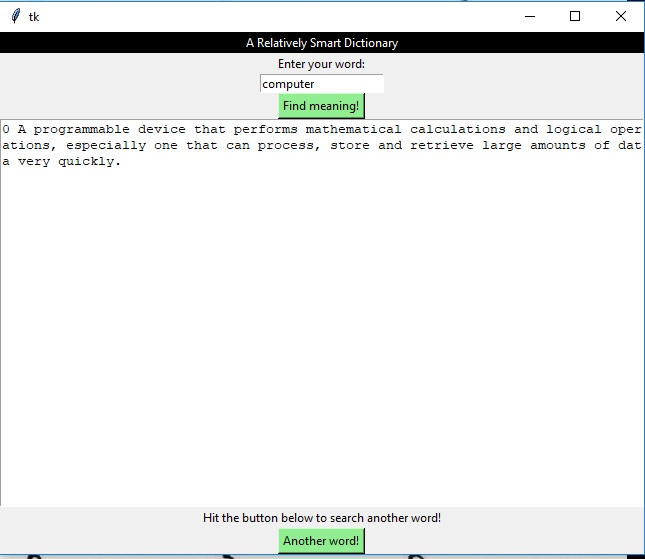
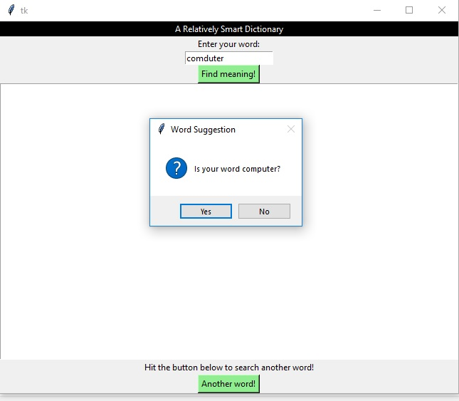

# Dictionary-GUI
 
 

This project is about a Graphical User Interface I built for an interactive dictionary using Python's Tkinter. The dictionary is relatively 
interactive as in if you misspell a word, the program suggests the closest correct word to the misspelled one. For example, if you typed in 
"comduter", the program would ask if your word is "computer". 

## Getting Started

If you have Python 3 in your machine, then you're good to go. Just download the json.data and front end.py and run the script. Note that "tkinter" is
a pre-installed module in Python. 

## Built With

* Python 
* Tkinter 

## Authors

* **Nawaj KC** - *Initial work* - [Dictionary GUI](https://github.com/Dictionary-GUI)

## Acknowledgments

* Ardit and his Python course in UDemy for inspiration on the core script to build the dictionary
* Bucky Roberts and his channel thenewboston for putting up tutorials on tkinter 

